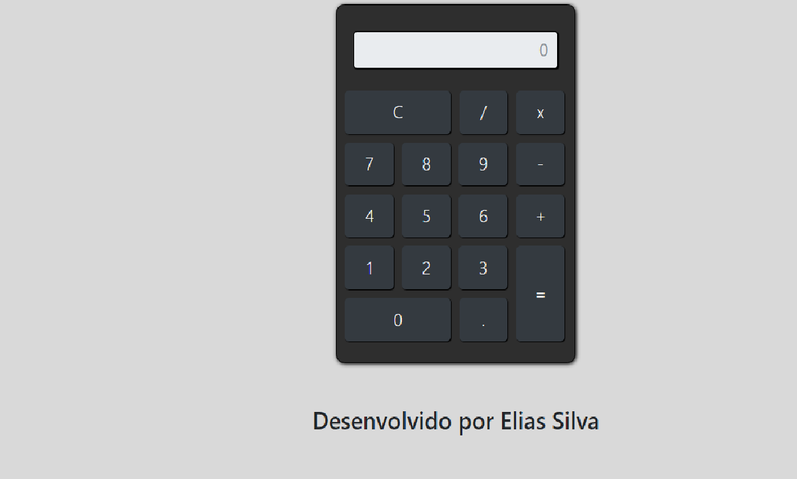

# Calculadora_padrao
O intuito do projeto era penas desenvolver uma calculadora com JS

### Tecnologias Utilizadas
- HTML
- CSS
- Javascript

Imagino que todo dev já desenvolveu uma calculadora eu não podia ficar de fora :)

Visualize o projeto : https://elias2031.github.io/Calculadora_padrao/

